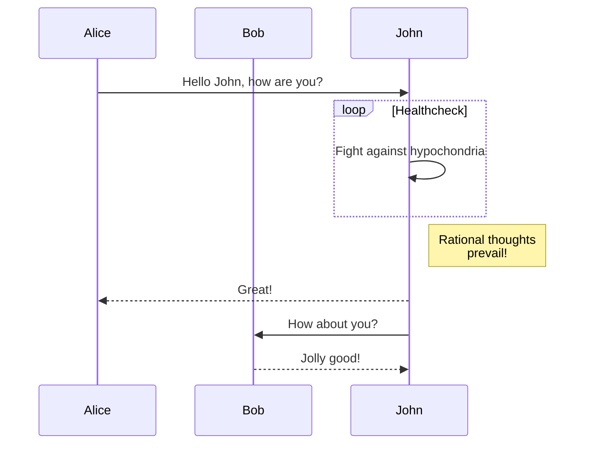

<!-- Headings -->
# Heading 1
## Heading 2
### Heading 3
#### Heading 4
##### Heading 5
###### Heading 6

<!-- Itatlics -->
*this text* is italic
_this text_ is italic

<!-- Strong -->
**this text** is strong
__this text__ is strong

<!-- striketrhough -->
~~This text~~ is striketrhough
<!-- Horizontall Rule -->

- - - 
___

<!-- blockquote -->
> This is a aquote


<!-- Link -->
[Huu Thong Le](https://github.com/tailwindlabs/tailwindcss-typography)
[Huu Thong Le](https://github.com/tailwindlabs/tailwindcss-typography "Le Huu Thong")

<!-- ul -->
* Item 1
  * Item 2
    * Item 3
      * Item 4

<!-- OL -->
1. Item 1
1. Item 2

<!-- Inine Code block -->
`<p>This is a paragraph</p>`

<!-- images -->


<!-- GitHub markdown -->
<!-- code blocks -->
```bash
npm install
npm start

```
```javascript
function add (num1, num2) {
  return num1 + num2
}
```

```python
def add (num1, num2) :
  return num1 + num2
```

<!-- tabkes -->
| Name |  Email |
| ---- | ------ |
| John Dde | fgds@gmail.com |
| John D | a@gmail.com |

<!-- Task Lists -->

* [x] task 1
* [ ] task 2


* Unordered list can use asterisks
- Or minuses
+ Or pluses

[I'm an inline-style link](https://www.google.com)

[I'm an inline-style link with title](https://www.google.com "Google's Homepage")

[I'm a reference-style link][Arbitrary case-insensitive reference text]

[I'm a relative reference to a repository file](../blob/master/LICENSE)

[You can use numbers for reference-style link definitions][1]

Or leave it empty and use the [link text itself].

URLs and URLs in angle brackets will automatically get turned into links. 
http://www.example.com or <http://www.example.com> and sometimes 
example.com (but not on Github, for example).

Some text to show that the reference links can follow later.

[arbitrary case-insensitive reference text]: https://www.mozilla.org
[1]: http://slashdot.org
[link text itself]: http://www.reddit.com

Inline-style: 


Reference-style: 
![alt text][logo]

[logo]: https://github.com/adam-p/markdown-here/raw/master/src/common/images/icon48.png "Logo Title Text 2"

Inline `code` has `back-ticks around` it `d`.

Here is a simple footnote[^1].

A footnote can also have multiple lines[^2].  

You can also use words, to fit your writing style more closely[^note].

[^1]: My reference.
[^2]: Every new line should be prefixed with 2 spaces.  
  This allows you to have a footnote with multiple lines.
[^note]:
    Named footnotes will still render with numbers instead of the text but allow easier identification and linking.  
    This footnote also has been made with a different syntax using 4 spaces for new lines.

Colons can be used to align columns.

| Tables        | Are           | Cool  |
| ------------- |:-------------:| -----:|
| col 3 is      | right-aligned | $1600 
| col 2 is      | centered      |   $12 |
| zebra stripes | are neat      |    $1 |

There must be at least 3 dashes separating each header cell.
The outer pipes (|) are optional, and you don't need to make the 
raw Markdown line up prettily. You can also use inline Markdown.

Markdown | Less | Pretty
--- | --- | ---
*Still* | `renders` | **nicely**
1 | 2 | 3
> Blockquotes are very handy in email to emulate reply text.
> This line is part of the same quote.

Quote break.

> This is a very long line that will still be quoted properly when it wraps. Oh boy let's keep writing to make sure this is long enough to actually wrap for everyone. Oh, you can *put* **Markdown** into a blockquote. 
> <dl>
  <dt>Definition list</dt>
  <dd>Is something people use sometimes.</dd>

  <dt>Markdown in HTML</dt>
  <dd>Does *not* work **very** well. Use HTML <em>tags</em>.</dd>
</dl>
<h4>dsada</h4>
<p>The HTML <code>button</code> tag defines a clickable button.</p>

<p>The CSS <code>background-color</code> property defines the background color of an element.</p>
Three or more...

---

Hyphens

***

Asterisks

___

Underscores
[](https://www.youtube.com/watch?v=BsxagQghWd0)

<!-- images -->


<picture>
 <source media="(prefers-color-scheme: dark)" srcset="https://scontent.xx.fbcdn.net/v/t39.30808-1/317952273_3537842193135542_1360730004811794769_n.jpg?stp=dst-jpg_p100x100&_nc_cat=110&ccb=1-7&_nc_sid=dbb9e7&_nc_ohc=NkfsZojVTWgAX8S2djY&_nc_ad=z-m&_nc_cid=0&_nc_ht=scontent.xx&oh=00_AfAORxWo41-i3jzdjE-fE5Z7IZuhm2FT6OHrHgnahWy3Lg&oe=642758C5">
 <source media="(prefers-color-scheme: light)" srcset="https://scontent-sjc3-1.xx.fbcdn.net/v/t39.30808-1/325899384_1207361870196959_9191418254938178212_n.jpg?stp=cp1_dst-jpg_p100x100&_nc_cat=108&ccb=1-7&_nc_sid=7206a8&_nc_ohc=cLVEoYadtQIAX8Scc-K&_nc_ad=z-m&_nc_cid=0&_nc_ht=scontent-sjc3-1.xx&oh=00_AfDhVKqTAVVOCuW5HwlY1N7MJCkZJ56wbrl5_kHi53AdLw&oe=6427409E">
 
</picture>


<details open >
  <summary>My top THINGS-TO-RANK</summary>

  YOUR TABLE
  | Rank | THING-TO-RANK |
  |-----:|---------------|
  |     1|      d         |
  |     2|       d        |
  |     3|       d        |
  <picture>
    <source media="(prefers-color-scheme: dark)" srcset="https://user-images.githubusercontent.com/25423296/163456776-7f95b81a-f1ed-45f7-b7ab-8fa810d529fa.png">
    <source media="(prefers-color-scheme: light)" srcset="https://user-images.githubusercontent.com/25423296/163456779-a8556205-d0a5-45e2-ac17-42d089e3c3f8.png">
    
  </picture>
  ---
  ---
  ___
</details>
<!-- COMMENT -->
## About me
<sub>ssadas </sub>
<!-- TO DO: add more details about me later -->
Some basic Git commands are:
```
git status
git add
git commit
```
The background color is `#ffffff` for light mode and `#000000` for dark mode.
[Contribution guidelines for this project](docs/CONTRIBUTING.md)
1. First list item
   - First nested list item
     - Second nested list item
@octocat :+1: This PR looks great - it's ready to merge! :shipit:
Here is a simple flow chart:


```geojson
{
  "type": "FeatureCollection",
  "features": [
    {
      "type": "Feature",
      "id": 1,
      "properties": {
        "ID": 0
      },
      "geometry": {
        "type": "Polygon",
        "coordinates": [
          [
              [-90,35],
              [-90,30],
              [-85,30],
              [-85,35],
              [-90,35]
          ]
        ]
      }
    }
  ]
}
```

```stl
solid cube_corner
  facet normal 0.0 -1.0 0.0
    outer loop
      vertex 0.0 0.0 0.0
      vertex 1.0 0.0 0.0
      vertex 0.0 0.0 1.0
    endloop
  endfacet
  facet normal 0.0 0.0 -1.0
    outer loop
      vertex 0.0 0.0 0.0
      vertex 0.0 1.0 0.0
      vertex 1.0 0.0 0.0
    endloop
  endfacet
  facet normal -1.0 0.0 0.0
    outer loop
      vertex 0.0 0.0 0.0
      vertex 0.0 0.0 1.0
      vertex 0.0 1.0 0.0
    endloop
  endfacet
  facet normal 0.577 0.577 0.577
    outer loop
      vertex 1.0 0.0 0.0
      vertex 0.0 1.0 0.0
      vertex 0.0 0.0 1.0
    endloop
  endfacet
endsolid
```
```topojson
{
  "type": "Topology",
  "transform": {
    "scale": [0.0005000500050005, 0.00010001000100010001],
    "translate": [100, 0]
  },
  "objects": {
    "example": {
      "type": "GeometryCollection",
      "geometries": [
        {
          "type": "Point",
          "properties": {"prop0": "value0"},
          "coordinates": [4000, 5000]
        },
        {
          "type": "LineString",
          "properties": {"prop0": "value0", "prop1": 0},
          "arcs": [0]
        },
        {
          "type": "Polygon",
          "properties": {"prop0": "value0",
            "prop1": {"this": "that"}
          },
          "arcs": [[1]]
        }
      ]
    }
  },
  "arcs": [[[4000, 0], [1999, 9999], [2000, -9999], [2000, 9999]],[[0, 0], [0, 9999], [2000, 0], [0, -9999], [-2000, 0]]]
}
```
- [x] #739
- [ ] https://github.com/octo-org/octo-repo/issues/740
- [ ] Add delight to the experience when all tasks are complete :tada:

```sh
npm install -D @tailwindcss/line-clamp
```